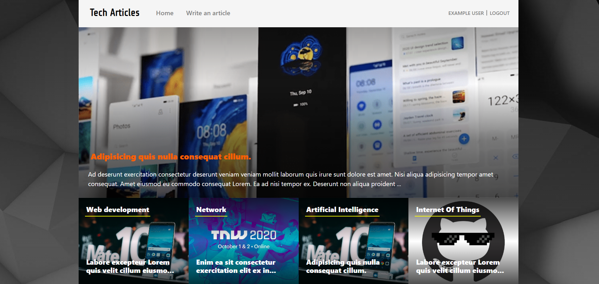

# Tech Articles

> This is a web app made with Ruby on Rails where users can share articles about technology and vote for them.

- The home page of this page is the categories page where you can see the different categories existing and the last
article of each one.
- The articles by category page contains all the articles in the chosen category ordered by the most recent.
- You can add an article by logging in and clicking on "write an article" and submitting the form.
## Live demo

Follow [this link](https://blooming-beyond-18904.herokuapp.com/) to try the app.

## Prerequisites

- Ruby 2.7.2
- Ruby on Rails 6.1.1

## Getting Started

To get a local copy up and running follow these simple example steps:

- Open your terminal
- Clone this project into the directory of your choice `git clone https://github.com/AymenBida/Tech-articles.git`
- Go to the project folder `cd Tech-articles`

### Install

- Run `bundle install`
- Run `yarn install`
- Create the database `rails db:create` 
- Migrate the database `rails db:migrate`
- Seed it `rails db:seed`

If you want to populate the database with some text and images run this task:
- `rails db:populate`

### Run

- Run `rails s` or `rails server`

### Test

- Run `rspec` while on the root directory of the app to run tests
    
### :hammer: Built With

* Ruby
* Rails

## Author

👤 **Aymen Bida**

- GitHub: [@AymenBida](https://github.com/AymenBida)
- LinkedIn: [AymenBida](https://www.linkedin.com/in/aymenbida/)
- Twitter: [@AymenBida](https://twitter.com/AymenBida)

## 🤝 Contributing

Contributions, issues and feature requests are welcome!

Feel free to check the [issues page](https://github.com/AymenBida/Tech-articles/issues)

## 📝 License

Copyright 2021 Aymen Bida

Permission is hereby granted, free of charge, to any person obtaining a copy of this software and associated documentation files (the "Software"), to deal in the Software without restriction, including without limitation the rights to use, copy, modify, merge, publish, distribute, sublicense, and/or sell copies of the Software, and to permit persons to whom the Software is furnished to do so, subject to the following conditions:

The above copyright notice and this permission notice shall be included in all copies or substantial portions of the Software.

THE SOFTWARE IS PROVIDED "AS IS", WITHOUT WARRANTY OF ANY KIND, EXPRESS OR IMPLIED, INCLUDING BUT NOT LIMITED TO THE WARRANTIES OF MERCHANTABILITY, FITNESS FOR A PARTICULAR PURPOSE AND NONINFRINGEMENT. IN NO EVENT SHALL THE AUTHORS OR COPYRIGHT HOLDERS BE LIABLE FOR ANY CLAIM, DAMAGES OR OTHER LIABILITY, WHETHER IN AN ACTION OF CONTRACT, TORT OR OTHERWISE, ARISING FROM, OUT OF OR IN CONNECTION WITH THE SOFTWARE OR THE USE OR OTHER DEALINGS IN THE SOFTWARE.

## Credits

- Design idea by Nelson Sakwa on Behance

## Show your support

Give a ⭐️ if you like this project!
